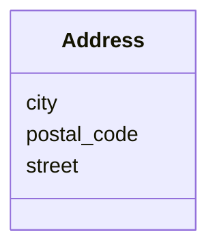

# Class: Address


URI: [schema:PostalAddress](http://schema.org/PostalAddress)





<!-- no inheritance hierarchy -->


## Slots

| Name | Cardinality and Range  | Description  |
| ---  | ---  | --- |
| [street](street.md) | 0..1 <br/> [xsd:string](http://www.w3.org/2001/XMLSchema#string)  |   |
| [city](city.md) | 0..1 <br/> [xsd:string](http://www.w3.org/2001/XMLSchema#string)  |   |
| [postal_code](postal_code.md) | 0..1 <br/> [xsd:string](http://www.w3.org/2001/XMLSchema#string)  |   |


## Usages


| used by | used in | type | used |
| ---  | --- | --- | --- |
| [Person](Person.md) | [current_address](current_address.md) | range | Address |


## Identifier and Mapping Information


### Schema Source


* from schema: https://w3id.org/my_org/my_datamodel


## Mappings

| Mapping Type | Mapped Value |
| ---  | ---  |
| self | ['schema:PostalAddress'] |
| native | ['my_datamodel:Address'] |


## LinkML Specification

<!-- TODO: investigate https://stackoverflow.com/questions/37606292/how-to-create-tabbed-code-blocks-in-mkdocs-or-sphinx -->

### Direct

<details>
```yaml
name: Address
from_schema: https://w3id.org/my_org/my_datamodel
rank: 1000
slots:
- street
- city
- postal_code
class_uri: schema:PostalAddress

```
</details>

### Induced

<details>
```yaml
name: Address
from_schema: https://w3id.org/my_org/my_datamodel
rank: 1000
attributes:
  street:
    name: street
    from_schema: https://w3id.org/my_org/my_datamodel
    rank: 1000
    alias: street
    owner: Address
    domain_of:
    - Address
    range: string
  city:
    name: city
    from_schema: https://w3id.org/my_org/my_datamodel
    rank: 1000
    alias: city
    owner: Address
    domain_of:
    - Address
    range: string
  postal_code:
    name: postal_code
    from_schema: https://w3id.org/my_org/my_datamodel
    rank: 1000
    alias: postal_code
    owner: Address
    domain_of:
    - Address
    range: string
class_uri: schema:PostalAddress

```
</details>