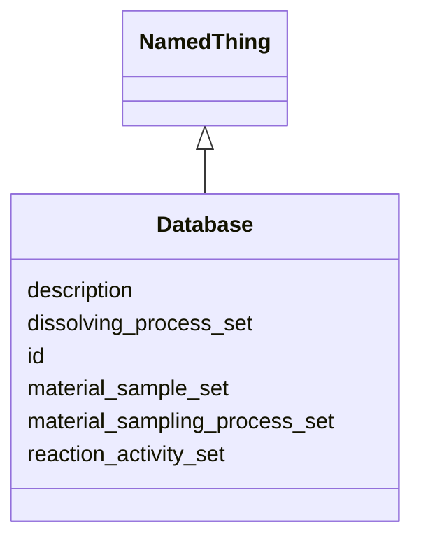

# Class: Database


URI: [monet_schema:Database](http://example.com/monet_schema/Database)





## Inheritance
* [NamedThing](NamedThing.md)
    * **Database**


## Slots

| Name | Cardinality and Range  | Description  |
| ---  | ---  | --- |
| [dissolving_process_set](dissolving_process_set.md) | 0..* <br/> [DissolvingProcess](DissolvingProcess.md)  |   |
| [material_sample_set](material_sample_set.md) | 0..* <br/> [MaterialSample](MaterialSample.md)  |   |
| [material_sampling_process_set](material_sampling_process_set.md) | 0..* <br/> [MaterialSamplingProcess](MaterialSamplingProcess.md)  |   |
| [reaction_activity_set](reaction_activity_set.md) | 0..* <br/> [ReactionActivity](ReactionActivity.md)  |   |
| [description](description.md) | 0..1 <br/> [xsd:string](xsd:string)  |   |
| [id](id.md) | 1..1 <br/> [xsd:string](xsd:string)  |   |


## Usages


## Identifier and Mapping Information


### Schema Source


* from schema: http://example.com/monet_schema


## Mappings

| Mapping Type | Mapped Value |
| ---  | ---  |
| self | ['monet_schema:Database'] |
| native | ['monet_schema:Database'] |


## LinkML Specification

<!-- TODO: investigate https://stackoverflow.com/questions/37606292/how-to-create-tabbed-code-blocks-in-mkdocs-or-sphinx -->

### Direct

<details>
```yaml
name: Database
title: database
from_schema: http://example.com/monet_schema
rank: 1000
is_a: NamedThing
slots:
- dissolving_process_set
- material_sample_set
- material_sampling_process_set
- reaction_activity_set

```
</details>

### Induced

<details>
```yaml
name: Database
title: database
from_schema: http://example.com/monet_schema
rank: 1000
is_a: NamedThing
attributes:
  dissolving_process_set:
    name: dissolving_process_set
    title: dissolving process set
    from_schema: http://example.com/monet_schema
    rank: 1000
    multivalued: true
    alias: dissolving_process_set
    owner: Database
    domain_of:
    - Database
    range: DissolvingProcess
    inlined_as_list: true
  material_sample_set:
    name: material_sample_set
    title: material sample set
    from_schema: http://example.com/monet_schema
    rank: 1000
    multivalued: true
    alias: material_sample_set
    owner: Database
    domain_of:
    - Database
    range: MaterialSample
    inlined_as_list: true
  material_sampling_process_set:
    name: material_sampling_process_set
    title: material sampling process set
    from_schema: http://example.com/monet_schema
    rank: 1000
    multivalued: true
    alias: material_sampling_process_set
    owner: Database
    domain_of:
    - Database
    range: MaterialSamplingProcess
    inlined_as_list: true
  reaction_activity_set:
    name: reaction_activity_set
    from_schema: http://example.com/monet_schema
    rank: 1000
    multivalued: true
    alias: reaction_activity_set
    owner: Database
    domain_of:
    - Database
    range: ReactionActivity
    inlined_as_list: true
  description:
    name: description
    title: description
    from_schema: http://example.com/monet_schema
    rank: 1000
    alias: description
    owner: Database
    domain_of:
    - NamedThing
    range: string
  id:
    name: id
    from_schema: http://example.com/monet_schema
    rank: 1000
    identifier: true
    alias: id
    owner: Database
    domain_of:
    - NamedThing
    range: string

```
</details>