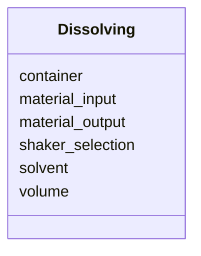

# Class: Dissolving


URI: [CHMO:0002773](http://purl.obolibrary.org/obo/CHMO_0002773)





<!-- no inheritance hierarchy -->


## Slots

| Name | Cardinality and Range  | Description  |
| ---  | ---  | --- |
| [material_input](material_input.md) | 1..1 <br/> [NamedThing](NamedThing.md)  |   |
| [material_output](material_output.md) | 1..1 <br/> [NamedThing](NamedThing.md)  |   |
| [container](container.md) | 1..1 <br/> [MaterialContainer](MaterialContainer.md)  |   |
| [shaker_selection](shaker_selection.md) | 1..1 <br/> [Shaker](Shaker.md)  |   |
| [solvent](solvent.md) | 1..1 <br/> [SolventEnum](SolventEnum.md)  |   |
| [volume](volume.md) | 1..1 <br/> [QuantityValue](QuantityValue.md)  |   |


## Usages


## Identifier and Mapping Information


### Schema Source


* from schema: http://example.com/monet_schema


## Mappings

| Mapping Type | Mapped Value |
| ---  | ---  |
| self | ['CHMO:0002773'] |
| native | ['monet_schema:Dissolving'] |


## LinkML Specification

<!-- TODO: investigate https://stackoverflow.com/questions/37606292/how-to-create-tabbed-code-blocks-in-mkdocs-or-sphinx -->

### Direct

<details>
```yaml
name: Dissolving
title: Dissolving
from_schema: http://example.com/monet_schema
aliases:
- dissolution-activity
rank: 1000
slots:
- material_input
- material_output
- container
- shaker_selection
- solvent
- volume
class_uri: CHMO:0002773

```
</details>

### Induced

<details>
```yaml
name: Dissolving
title: Dissolving
from_schema: http://example.com/monet_schema
aliases:
- dissolution-activity
rank: 1000
attributes:
  material_input:
    name: material_input
    title: material input
    examples:
    - value: somextract:6
    - value: soil:1
    from_schema: http://example.com/monet_schema
    aliases:
    - weighing-activity.source_material
    rank: 1000
    alias: material_input
    owner: Dissolving
    domain_of:
    - MatSampProc
    - Dissolving
    range: NamedThing
    required: true
    inlined: true
    inlined_as_list: true
  material_output:
    name: material_output
    title: material output
    examples:
    - value: somextract:7
    - value: somextract:6
    from_schema: http://example.com/monet_schema
    aliases:
    - weighing-activity.id
    rank: 1000
    alias: material_output
    owner: Dissolving
    domain_of:
    - MatSampProc
    - Dissolving
    range: NamedThing
    required: true
    inlined: true
    inlined_as_list: true
  container:
    name: container
    from_schema: http://example.com/monet_schema
    rank: 1000
    alias: container
    owner: Dissolving
    domain_of:
    - Dissolving
    range: MaterialContainer
    required: true
    inlined: true
    inlined_as_list: true
  shaker_selection:
    name: shaker_selection
    title: shaker selection
    from_schema: http://example.com/monet_schema
    rank: 1000
    alias: shaker_selection
    owner: Dissolving
    domain_of:
    - Dissolving
    range: Shaker
    required: true
    inlined: true
    inlined_as_list: true
  solvent:
    name: solvent
    title: solvent
    from_schema: http://example.com/monet_schema
    rank: 1000
    alias: solvent
    owner: Dissolving
    domain_of:
    - Dissolving
    range: SolventEnum
    required: true
  volume:
    name: volume
    title: volume
    from_schema: http://example.com/monet_schema
    rank: 1000
    alias: volume
    owner: Dissolving
    domain_of:
    - Dissolving
    range: QuantityValue
    required: true
    inlined: true
    inlined_as_list: true
class_uri: CHMO:0002773

```
</details>