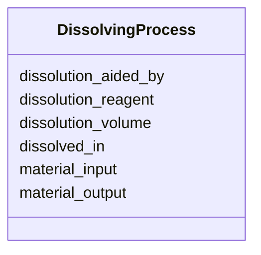

# Class: DissolvingProcess


URI: [CHMO:0002773](http://purl.obolibrary.org/obo/CHMO_0002773)





<!-- no inheritance hierarchy -->


## Slots

| Name | Cardinality and Range  | Description  |
| ---  | ---  | --- |
| [dissolution_aided_by](dissolution_aided_by.md) | 0..1 <br/> [LabDevice](LabDevice.md)  |   |
| [dissolution_reagent](dissolution_reagent.md) | 0..1 <br/> [SolventEnum](SolventEnum.md)  |   |
| [dissolution_volume](dissolution_volume.md) | 0..1 <br/> [QuantityValue](QuantityValue.md)  |   |
| [dissolved_in](dissolved_in.md) | 0..1 <br/> [MaterialContainer](MaterialContainer.md)  |   |
| [material_input](material_input.md) | 0..1 <br/> [MaterialSample](MaterialSample.md)  |   |
| [material_output](material_output.md) | 0..1 <br/> [MaterialSample](MaterialSample.md)  |   |


## Usages


| used by | used in | type | used |
| ---  | --- | --- | --- |
| [Database](Database.md) | [dissolving_process_set](dissolving_process_set.md) | range | DissolvingProcess |


## Identifier and Mapping Information


### Schema Source


* from schema: http://example.com/monet_schema


## Mappings

| Mapping Type | Mapped Value |
| ---  | ---  |
| self | ['CHMO:0002773'] |
| native | ['monet_schema:DissolvingProcess'] |


## LinkML Specification

<!-- TODO: investigate https://stackoverflow.com/questions/37606292/how-to-create-tabbed-code-blocks-in-mkdocs-or-sphinx -->

### Direct

<details>
```yaml
name: DissolvingProcess
title: Dissolving process
from_schema: http://example.com/monet_schema
aliases:
- dissolution-activity
rank: 1000
slots:
- dissolution_aided_by
- dissolution_reagent
- dissolution_volume
- dissolved_in
- material_input
- material_output
class_uri: CHMO:0002773

```
</details>

### Induced

<details>
```yaml
name: DissolvingProcess
title: Dissolving process
from_schema: http://example.com/monet_schema
aliases:
- dissolution-activity
rank: 1000
attributes:
  dissolution_aided_by:
    name: dissolution_aided_by
    title: dissolution aided by
    from_schema: http://example.com/monet_schema
    aliases:
    - shaker
    rank: 1000
    alias: dissolution_aided_by
    owner: DissolvingProcess
    domain_of:
    - DissolvingProcess
    range: LabDevice
    inlined: true
  dissolution_reagent:
    name: dissolution_reagent
    title: dissolution reagent
    from_schema: http://example.com/monet_schema
    aliases:
    - solvent
    rank: 1000
    alias: dissolution_reagent
    owner: DissolvingProcess
    domain_of:
    - DissolvingProcess
    range: SolventEnum
  dissolution_volume:
    name: dissolution_volume
    title: dissolution volume
    from_schema: http://example.com/monet_schema
    aliases:
    - volume
    rank: 1000
    alias: dissolution_volume
    owner: DissolvingProcess
    domain_of:
    - DissolvingProcess
    range: QuantityValue
    inlined: true
  dissolved_in:
    name: dissolved_in
    title: dissolved in
    from_schema: http://example.com/monet_schema
    aliases:
    - container
    rank: 1000
    alias: dissolved_in
    owner: DissolvingProcess
    domain_of:
    - DissolvingProcess
    range: MaterialContainer
    inlined: true
  material_input:
    name: material_input
    title: material input
    examples:
    - value: somextract:6
    - value: soil:1
    from_schema: http://example.com/monet_schema
    aliases:
    - weighing-activity.source_material
    rank: 1000
    alias: material_input
    owner: DissolvingProcess
    domain_of:
    - DissolvingProcess
    - MaterialSamplingProcess
    - ReactionActivity
    range: MaterialSample
  material_output:
    name: material_output
    title: material output
    examples:
    - value: somextract:7
    - value: somextract:6
    from_schema: http://example.com/monet_schema
    aliases:
    - weighing-activity.id
    rank: 1000
    alias: material_output
    owner: DissolvingProcess
    domain_of:
    - DissolvingProcess
    - MaterialSamplingProcess
    - ReactionActivity
    range: MaterialSample
class_uri: CHMO:0002773

```
</details>