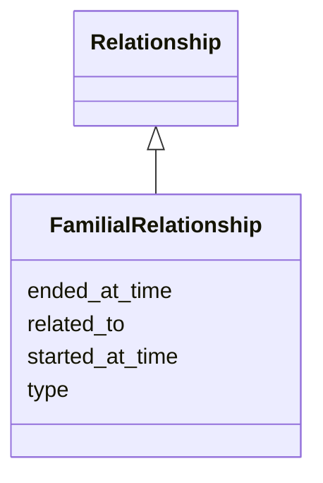

# Class: FamilialRelationship


URI: [my_datamodel:FamilialRelationship](https://w3id.org/my_org/my_datamodelFamilialRelationship)





## Inheritance
* [Relationship](Relationship.md)
    * **FamilialRelationship**


## Slots

| Name | Cardinality and Range  | Description  |
| ---  | ---  | --- |
| [started_at_time](started_at_time.md) | 0..1 <br/> [xsd:date](http://www.w3.org/2001/XMLSchema#date)  |   |
| [ended_at_time](ended_at_time.md) | 0..1 <br/> [xsd:date](http://www.w3.org/2001/XMLSchema#date)  |   |
| [related_to](related_to.md) | 0..1 <br/> [xsd:string](http://www.w3.org/2001/XMLSchema#string)  |   |
| [type](type.md) | 1..1 <br/> [FamilialRelationshipType](FamilialRelationshipType.md)  |   |


## Usages


| used by | used in | type | used |
| ---  | --- | --- | --- |
| [Person](Person.md) | [has_familial_relationships](has_familial_relationships.md) | range | FamilialRelationship |


## Identifier and Mapping Information


### Schema Source


* from schema: https://w3id.org/my_org/my_datamodel


## Mappings

| Mapping Type | Mapped Value |
| ---  | ---  |
| self | ['my_datamodel:FamilialRelationship'] |
| native | ['my_datamodel:FamilialRelationship'] |


## LinkML Specification

<!-- TODO: investigate https://stackoverflow.com/questions/37606292/how-to-create-tabbed-code-blocks-in-mkdocs-or-sphinx -->

### Direct

<details>
```yaml
name: FamilialRelationship
from_schema: https://w3id.org/my_org/my_datamodel
rank: 1000
is_a: Relationship
slot_usage:
  type:
    name: type
    domain_of:
    - Relationship
    - Relationship
    range: FamilialRelationshipType
    required: true
  related to:
    name: related to
    range: Person
    required: true

```
</details>

### Induced

<details>
```yaml
name: FamilialRelationship
from_schema: https://w3id.org/my_org/my_datamodel
rank: 1000
is_a: Relationship
slot_usage:
  type:
    name: type
    domain_of:
    - Relationship
    - Relationship
    range: FamilialRelationshipType
    required: true
  related to:
    name: related to
    range: Person
    required: true
attributes:
  started_at_time:
    name: started_at_time
    from_schema: https://w3id.org/my_org/my_datamodel
    rank: 1000
    slot_uri: prov:startedAtTime
    alias: started_at_time
    owner: FamilialRelationship
    domain_of:
    - Relationship
    range: date
  ended_at_time:
    name: ended_at_time
    from_schema: https://w3id.org/my_org/my_datamodel
    rank: 1000
    slot_uri: prov:endedAtTime
    alias: ended_at_time
    owner: FamilialRelationship
    domain_of:
    - Relationship
    range: date
  related_to:
    name: related_to
    from_schema: https://w3id.org/my_org/my_datamodel
    rank: 1000
    alias: related_to
    owner: FamilialRelationship
    domain_of:
    - Relationship
    range: string
  type:
    name: type
    from_schema: https://w3id.org/my_org/my_datamodel
    rank: 1000
    alias: type
    owner: FamilialRelationship
    domain_of:
    - Relationship
    - Relationship
    range: FamilialRelationshipType
    required: true

```
</details>