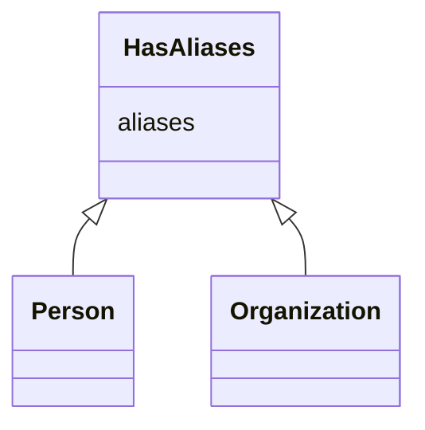

# Class: HasAliases
_A mixin applied to any class that can have aliases/alternateNames_


* __NOTE__: this is a mixin class intended to be used in combination with other classes, and not used directly


URI: [my_datamodel:HasAliases](https://w3id.org/my_org/my_datamodelHasAliases)





<!-- no inheritance hierarchy -->


## Slots

| Name | Cardinality and Range  | Description  |
| ---  | ---  | --- |
| [aliases](aliases.md) | 0..* <br/> [xsd:string](http://www.w3.org/2001/XMLSchema#string)  |   |


## Usages


## Identifier and Mapping Information


### Schema Source


* from schema: https://w3id.org/my_org/my_datamodel


## Mappings

| Mapping Type | Mapped Value |
| ---  | ---  |
| self | ['my_datamodel:HasAliases'] |
| native | ['my_datamodel:HasAliases'] |


## LinkML Specification

<!-- TODO: investigate https://stackoverflow.com/questions/37606292/how-to-create-tabbed-code-blocks-in-mkdocs-or-sphinx -->

### Direct

<details>
```yaml
name: HasAliases
description: A mixin applied to any class that can have aliases/alternateNames
from_schema: https://w3id.org/my_org/my_datamodel
rank: 1000
mixin: true
attributes:
  aliases:
    name: aliases
    from_schema: https://w3id.org/my_org/my_datamodel
    exact_mappings:
    - schema:alternateName
    rank: 1000
    multivalued: true

```
</details>

### Induced

<details>
```yaml
name: HasAliases
description: A mixin applied to any class that can have aliases/alternateNames
from_schema: https://w3id.org/my_org/my_datamodel
rank: 1000
mixin: true
attributes:
  aliases:
    name: aliases
    from_schema: https://w3id.org/my_org/my_datamodel
    exact_mappings:
    - schema:alternateName
    rank: 1000
    multivalued: true
    alias: aliases
    owner: HasAliases
    domain_of:
    - HasAliases
    range: string

```
</details>