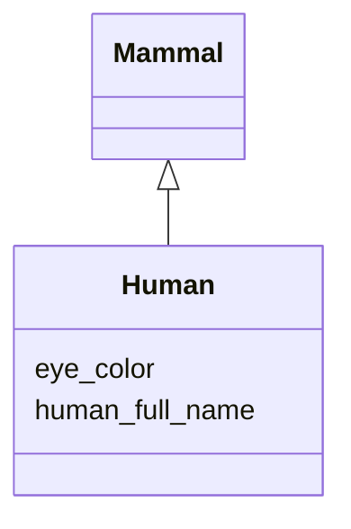

# Class: Human


URI: [hackschema:Human](http://example.com/hackschema/Human)





## Inheritance
* [Mammal](Mammal.md)
    * **Human**


## Slots

| Name | Cardinality and Range  | Description  |
| ---  | ---  | --- |
| [human_full_name](human_full_name.md) | 0..1 <br/> [xsd:string](xsd:string)  | The word, words or phrase that the human's mother uses or used to get the att...  |
| [eye_color](eye_color.md) | 0..1 <br/> [xsd:string](xsd:string)  |   |


## Usages


## Identifier and Mapping Information


### Schema Source


* from schema: http://example.com/hackschema


## Mappings

| Mapping Type | Mapped Value |
| ---  | ---  |
| self | ['hackschema:Human'] |
| native | ['hackschema:Human'] |


## LinkML Specification

<!-- TODO: investigate https://stackoverflow.com/questions/37606292/how-to-create-tabbed-code-blocks-in-mkdocs-or-sphinx -->

### Direct

<details>
```yaml
name: Human
from_schema: http://example.com/hackschema
rank: 1000
is_a: Mammal
slots:
- human_full_name
slot_usage:
  human_full_name:
    name: human_full_name
    domain_of:
    - Human
    - Human

```
</details>

### Induced

<details>
```yaml
name: Human
from_schema: http://example.com/hackschema
rank: 1000
is_a: Mammal
slot_usage:
  human_full_name:
    name: human_full_name
    domain_of:
    - Human
    - Human
attributes:
  human_full_name:
    name: human_full_name
    description: The word, words or phrase that the human's mother uses or used to
      get the attention of the human
    from_schema: http://example.com/hackschema
    rank: 1000
    alias: human_full_name
    owner: Human
    domain_of:
    - Human
    range: string
  eye_color:
    name: eye_color
    title: eye color
    from_schema: http://example.com/hackschema
    rank: 1000
    alias: eye_color
    owner: Human
    domain_of:
    - Mammal
    range: string

```
</details>