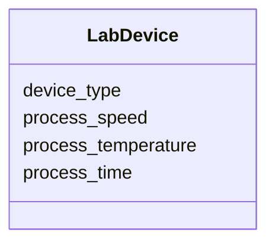

# Class: LabDevice


URI: [monet_schema:LabDevice](http://example.com/monet_schema/LabDevice)





<!-- no inheritance hierarchy -->


## Slots

| Name | Cardinality and Range  | Description  |
| ---  | ---  | --- |
| [device_type](device_type.md) | 0..1 <br/> [DeviceTypeEnum](DeviceTypeEnum.md)  |   |
| [process_speed](process_speed.md) | 0..1 <br/> [QuantityValue](QuantityValue.md)  |   |
| [process_temperature](process_temperature.md) | 0..1 <br/> [QuantityValue](QuantityValue.md)  |   |
| [process_time](process_time.md) | 0..1 <br/> [QuantityValue](QuantityValue.md)  |   |


## Usages


| used by | used in | type | used |
| ---  | --- | --- | --- |
| [DissolvingProcess](DissolvingProcess.md) | [dissolution_aided_by](dissolution_aided_by.md) | range | LabDevice |
| [ReactionActivity](ReactionActivity.md) | [reaction_aided_by](reaction_aided_by.md) | range | LabDevice |


## Identifier and Mapping Information


### Schema Source


* from schema: http://example.com/monet_schema


## Mappings

| Mapping Type | Mapped Value |
| ---  | ---  |
| self | ['monet_schema:LabDevice'] |
| native | ['monet_schema:LabDevice'] |


## LinkML Specification

<!-- TODO: investigate https://stackoverflow.com/questions/37606292/how-to-create-tabbed-code-blocks-in-mkdocs-or-sphinx -->

### Direct

<details>
```yaml
name: LabDevice
title: Lab device
from_schema: http://example.com/monet_schema
rank: 1000
slots:
- device_type
- process_speed
- process_temperature
- process_time

```
</details>

### Induced

<details>
```yaml
name: LabDevice
title: Lab device
from_schema: http://example.com/monet_schema
rank: 1000
attributes:
  device_type:
    name: device_type
    title: device type
    from_schema: http://example.com/monet_schema
    aliases:
    - shaker type
    rank: 1000
    alias: device_type
    owner: LabDevice
    domain_of:
    - LabDevice
    range: DeviceTypeEnum
  process_speed:
    name: process_speed
    title: process speed
    from_schema: http://example.com/monet_schema
    aliases:
    - shake_speed
    rank: 1000
    alias: process_speed
    owner: LabDevice
    domain_of:
    - LabDevice
    range: QuantityValue
    inlined: true
  process_temperature:
    name: process_temperature
    todos:
    - constrain units
    from_schema: http://example.com/monet_schema
    rank: 1000
    alias: process_temperature
    owner: LabDevice
    domain_of:
    - LabDevice
    range: QuantityValue
    inlined: true
  process_time:
    name: process_time
    title: process time
    from_schema: http://example.com/monet_schema
    aliases:
    - shake_time
    rank: 1000
    alias: process_time
    owner: LabDevice
    domain_of:
    - LabDevice
    range: QuantityValue
    inlined: true

```
</details>