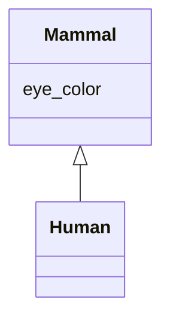

# Class: Mammal


URI: [hackschema:Mammal](http://example.com/hackschema/Mammal)





## Inheritance
* **Mammal**
    * [Human](Human.md)


## Slots

| Name | Cardinality and Range  | Description  |
| ---  | ---  | --- |
| [eye_color](eye_color.md) | 0..1 <br/> [xsd:string](xsd:string)  |   |


## Usages


## Identifier and Mapping Information


### Schema Source


* from schema: http://example.com/hackschema


## Mappings

| Mapping Type | Mapped Value |
| ---  | ---  |
| self | ['hackschema:Mammal'] |
| native | ['hackschema:Mammal'] |


## LinkML Specification

<!-- TODO: investigate https://stackoverflow.com/questions/37606292/how-to-create-tabbed-code-blocks-in-mkdocs-or-sphinx -->

### Direct

<details>
```yaml
name: Mammal
from_schema: http://example.com/hackschema
rank: 1000
slots:
- eye_color
slot_usage:
  eye_color:
    name: eye_color
    domain_of:
    - Mammal
    - Mammal

```
</details>

### Induced

<details>
```yaml
name: Mammal
from_schema: http://example.com/hackschema
rank: 1000
slot_usage:
  eye_color:
    name: eye_color
    domain_of:
    - Mammal
    - Mammal
attributes:
  eye_color:
    name: eye_color
    title: eye color
    from_schema: http://example.com/hackschema
    rank: 1000
    alias: eye_color
    owner: Mammal
    domain_of:
    - Mammal
    - Mammal
    range: string

```
</details>