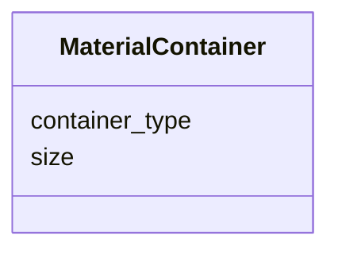

# Class: MaterialContainer


URI: [monet_schema:MaterialContainer](http://example.com/monet_schema/MaterialContainer)





<!-- no inheritance hierarchy -->


## Slots

| Name | Cardinality and Range  | Description  |
| ---  | ---  | --- |
| [container_type](container_type.md) | 1..1 <br/> [ContainerTypeEnum](ContainerTypeEnum.md)  |   |
| [size](size.md) | 1..1 <br/> [QuantityValue](QuantityValue.md)  |   |


## Usages


| used by | used in | type | used |
| ---  | --- | --- | --- |
| [MatSampProc](MatSampProc.md) | [collected_into](collected_into.md) | range | MaterialContainer |
| [Dissolving](Dissolving.md) | [container](container.md) | range | MaterialContainer |


## Identifier and Mapping Information


### Schema Source


* from schema: http://example.com/monet_schema


## Mappings

| Mapping Type | Mapped Value |
| ---  | ---  |
| self | ['monet_schema:MaterialContainer'] |
| native | ['monet_schema:MaterialContainer'] |


## LinkML Specification

<!-- TODO: investigate https://stackoverflow.com/questions/37606292/how-to-create-tabbed-code-blocks-in-mkdocs-or-sphinx -->

### Direct

<details>
```yaml
name: MaterialContainer
title: Material container
from_schema: http://example.com/monet_schema
rank: 1000
slots:
- container_type
- size

```
</details>

### Induced

<details>
```yaml
name: MaterialContainer
title: Material container
from_schema: http://example.com/monet_schema
rank: 1000
attributes:
  container_type:
    name: container_type
    title: container type
    from_schema: http://example.com/monet_schema
    rank: 1000
    alias: container_type
    owner: MaterialContainer
    domain_of:
    - MaterialContainer
    range: ContainerTypeEnum
    required: true
  size:
    name: size
    title: size
    from_schema: http://example.com/monet_schema
    rank: 1000
    alias: size
    owner: MaterialContainer
    domain_of:
    - MaterialContainer
    range: QuantityValue
    required: true
    inlined: true
    inlined_as_list: true

```
</details>