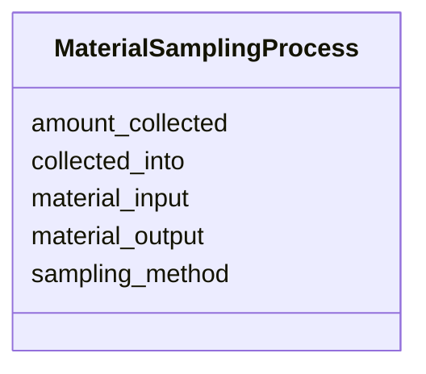

# Class: MaterialSamplingProcess


URI: [OBI:0000744](http://purl.obolibrary.org/obo/OBI_0000744)





<!-- no inheritance hierarchy -->


## Slots

| Name | Cardinality and Range  | Description  |
| ---  | ---  | --- |
| [amount_collected](amount_collected.md) | 0..1 <br/> [QuantityValue](QuantityValue.md)  |   |
| [collected_into](collected_into.md) | 0..1 <br/> [MaterialContainer](MaterialContainer.md)  |   |
| [material_input](material_input.md) | 0..1 <br/> [MaterialSample](MaterialSample.md)  |   |
| [material_output](material_output.md) | 0..1 <br/> [MaterialSample](MaterialSample.md)  |   |
| [sampling_method](sampling_method.md) | 0..1 <br/> [SamplingMethodEnum](SamplingMethodEnum.md)  |   |


## Usages


| used by | used in | type | used |
| ---  | --- | --- | --- |
| [Database](Database.md) | [material_sampling_process_set](material_sampling_process_set.md) | range | MaterialSamplingProcess |


## Identifier and Mapping Information


### Schema Source


* from schema: http://example.com/monet_schema


## Mappings

| Mapping Type | Mapped Value |
| ---  | ---  |
| self | ['OBI:0000744'] |
| native | ['monet_schema:MaterialSamplingProcess'] |


## LinkML Specification

<!-- TODO: investigate https://stackoverflow.com/questions/37606292/how-to-create-tabbed-code-blocks-in-mkdocs-or-sphinx -->

### Direct

<details>
```yaml
name: MaterialSamplingProcess
title: Material sampling process
from_schema: http://example.com/monet_schema
aliases:
- weighing-activity
rank: 1000
slots:
- amount_collected
- collected_into
- material_input
- material_output
- sampling_method
class_uri: OBI:0000744

```
</details>

### Induced

<details>
```yaml
name: MaterialSamplingProcess
title: Material sampling process
from_schema: http://example.com/monet_schema
aliases:
- weighing-activity
rank: 1000
attributes:
  amount_collected:
    name: amount_collected
    title: amount collected
    from_schema: http://example.com/monet_schema
    aliases:
    - weighing-activity.weight
    rank: 1000
    alias: amount_collected
    owner: MaterialSamplingProcess
    domain_of:
    - MaterialSamplingProcess
    range: QuantityValue
    inlined: true
  collected_into:
    name: collected_into
    title: collected into
    from_schema: http://example.com/monet_schema
    aliases:
    - weighing-activity.contanier
    rank: 1000
    alias: collected_into
    owner: MaterialSamplingProcess
    domain_of:
    - MaterialSamplingProcess
    range: MaterialContainer
    inlined: true
  material_input:
    name: material_input
    title: material input
    examples:
    - value: somextract:6
    - value: soil:1
    from_schema: http://example.com/monet_schema
    aliases:
    - weighing-activity.source_material
    rank: 1000
    alias: material_input
    owner: MaterialSamplingProcess
    domain_of:
    - DissolvingProcess
    - MaterialSamplingProcess
    - ReactionActivity
    range: MaterialSample
  material_output:
    name: material_output
    title: material output
    examples:
    - value: somextract:7
    - value: somextract:6
    from_schema: http://example.com/monet_schema
    aliases:
    - weighing-activity.id
    rank: 1000
    alias: material_output
    owner: MaterialSamplingProcess
    domain_of:
    - DissolvingProcess
    - MaterialSamplingProcess
    - ReactionActivity
    range: MaterialSample
  sampling_method:
    name: sampling_method
    title: sampling method
    from_schema: http://example.com/monet_schema
    rank: 1000
    alias: sampling_method
    owner: MaterialSamplingProcess
    domain_of:
    - MaterialSamplingProcess
    range: SamplingMethodEnum
class_uri: OBI:0000744

```
</details>