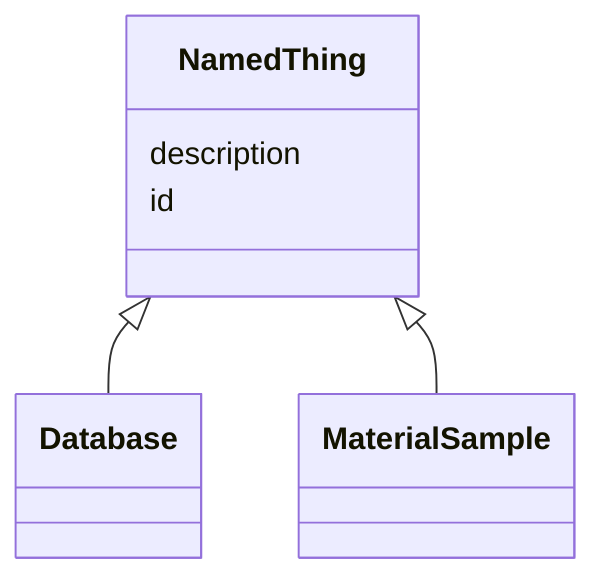

# Class: NamedThing


URI: [monet_schema:NamedThing](http://example.com/monet_schema/NamedThing)





## Inheritance
* **NamedThing**
    * [Database](Database.md)
    * [MaterialSample](MaterialSample.md)


## Slots

| Name | Cardinality and Range  | Description  |
| ---  | ---  | --- |
| [description](description.md) | 0..1 <br/> [xsd:string](xsd:string)  |   |
| [id](id.md) | 1..1 <br/> [xsd:string](xsd:string)  |   |


## Usages


## Identifier and Mapping Information


### Schema Source


* from schema: http://example.com/monet_schema


## Mappings

| Mapping Type | Mapped Value |
| ---  | ---  |
| self | ['monet_schema:NamedThing'] |
| native | ['monet_schema:NamedThing'] |


## LinkML Specification

<!-- TODO: investigate https://stackoverflow.com/questions/37606292/how-to-create-tabbed-code-blocks-in-mkdocs-or-sphinx -->

### Direct

<details>
```yaml
name: NamedThing
from_schema: http://example.com/monet_schema
rank: 1000
slots:
- description
- id

```
</details>

### Induced

<details>
```yaml
name: NamedThing
from_schema: http://example.com/monet_schema
rank: 1000
attributes:
  description:
    name: description
    title: description
    from_schema: http://example.com/monet_schema
    rank: 1000
    alias: description
    owner: NamedThing
    domain_of:
    - NamedThing
    range: string
  id:
    name: id
    from_schema: http://example.com/monet_schema
    rank: 1000
    identifier: true
    alias: id
    owner: NamedThing
    domain_of:
    - NamedThing
    range: string

```
</details>