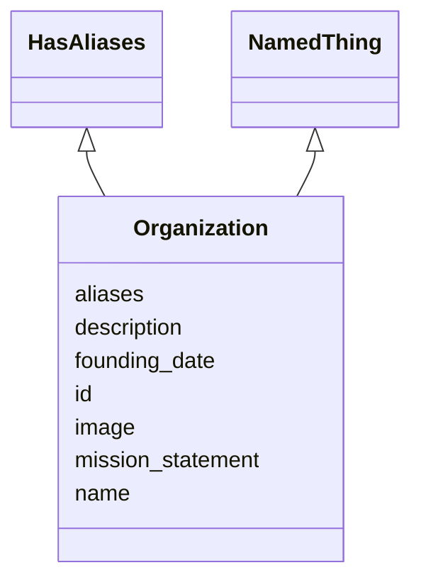

# Class: Organization
_An organization such as a company or university_


URI: [schema:Organization](http://schema.org/Organization)





## Inheritance
* [NamedThing](NamedThing.md)
    * **Organization** [ HasAliases]


## Slots

| Name | Cardinality and Range  | Description  |
| ---  | ---  | --- |
| [mission_statement](mission_statement.md) | 0..1 <br/> [xsd:string](http://www.w3.org/2001/XMLSchema#string)  |   |
| [founding_date](founding_date.md) | 0..1 <br/> [xsd:string](http://www.w3.org/2001/XMLSchema#string)  |   |
| [aliases](aliases.md) | 0..* <br/> [xsd:string](http://www.w3.org/2001/XMLSchema#string)  |   |
| [id](id.md) | 1..1 <br/> [xsd:string](http://www.w3.org/2001/XMLSchema#string)  |   |
| [name](name.md) | 0..1 <br/> [xsd:string](http://www.w3.org/2001/XMLSchema#string)  |   |
| [description](description.md) | 0..1 <br/> [xsd:string](http://www.w3.org/2001/XMLSchema#string)  |   |
| [image](image.md) | 0..1 <br/> [xsd:string](http://www.w3.org/2001/XMLSchema#string)  |   |


## Usages


| used by | used in | type | used |
| ---  | --- | --- | --- |
| [Registry](Registry.md) | [organizations](organizations.md) | range | Organization |


## Identifier and Mapping Information


### Schema Source


* from schema: https://w3id.org/my_org/my_datamodel


## Mappings

| Mapping Type | Mapped Value |
| ---  | ---  |
| self | ['schema:Organization'] |
| native | ['my_datamodel:Organization'] |


## LinkML Specification

<!-- TODO: investigate https://stackoverflow.com/questions/37606292/how-to-create-tabbed-code-blocks-in-mkdocs-or-sphinx -->

### Direct

<details>
```yaml
name: Organization
description: An organization such as a company or university
from_schema: https://w3id.org/my_org/my_datamodel
rank: 1000
is_a: NamedThing
mixins:
- HasAliases
slots:
- mission_statement
- founding_date
class_uri: schema:Organization

```
</details>

### Induced

<details>
```yaml
name: Organization
description: An organization such as a company or university
from_schema: https://w3id.org/my_org/my_datamodel
rank: 1000
is_a: NamedThing
mixins:
- HasAliases
attributes:
  mission_statement:
    name: mission_statement
    from_schema: https://w3id.org/my_org/my_datamodel
    rank: 1000
    alias: mission_statement
    owner: Organization
    domain_of:
    - Organization
    range: string
  founding_date:
    name: founding_date
    from_schema: https://w3id.org/my_org/my_datamodel
    rank: 1000
    alias: founding_date
    owner: Organization
    domain_of:
    - Organization
    range: string
  aliases:
    name: aliases
    from_schema: https://w3id.org/my_org/my_datamodel
    exact_mappings:
    - schema:alternateName
    rank: 1000
    multivalued: true
    alias: aliases
    owner: Organization
    domain_of:
    - HasAliases
    range: string
  id:
    name: id
    from_schema: https://w3id.org/my_org/my_datamodel
    rank: 1000
    slot_uri: schema:identifier
    identifier: true
    alias: id
    owner: Organization
    domain_of:
    - NamedThing
    range: string
  name:
    name: name
    from_schema: https://w3id.org/my_org/my_datamodel
    rank: 1000
    slot_uri: schema:name
    alias: name
    owner: Organization
    domain_of:
    - NamedThing
    range: string
  description:
    name: description
    from_schema: https://w3id.org/my_org/my_datamodel
    rank: 1000
    slot_uri: schema:description
    alias: description
    owner: Organization
    domain_of:
    - NamedThing
    range: string
  image:
    name: image
    from_schema: https://w3id.org/my_org/my_datamodel
    rank: 1000
    slot_uri: schema:image
    alias: image
    owner: Organization
    domain_of:
    - NamedThing
    range: string
class_uri: schema:Organization

```
</details>