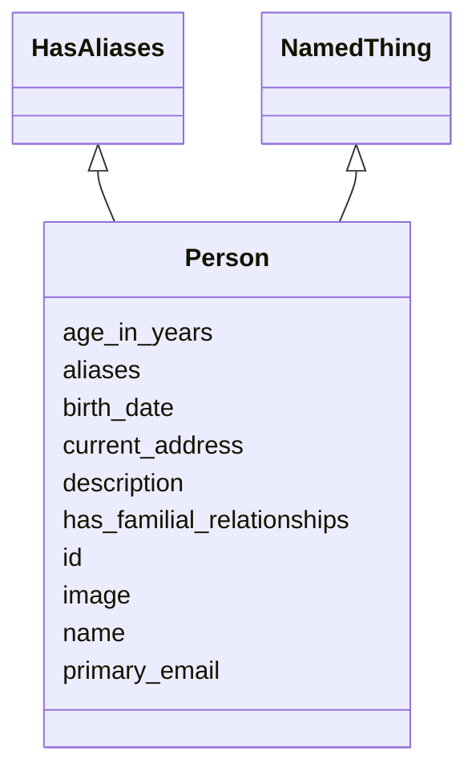

# Class: Person
_A person (alive, dead, undead, or fictional)._


URI: [schema:Person](http://schema.org/Person)





## Inheritance
* [NamedThing](NamedThing.md)
    * **Person** [ HasAliases]


## Slots

| Name | Cardinality and Range  | Description  |
| ---  | ---  | --- |
| [primary_email](primary_email.md) | 0..1 <br/> [xsd:string](http://www.w3.org/2001/XMLSchema#string)  |   |
| [birth_date](birth_date.md) | 0..1 <br/> [xsd:string](http://www.w3.org/2001/XMLSchema#string)  |   |
| [age_in_years](age_in_years.md) | 0..1 <br/> [xsd:integer](http://www.w3.org/2001/XMLSchema#integer)  |   |
| [current_address](current_address.md) | 0..1 <br/> [Address](Address.md)  | The address at which a person currently lives  |
| [has_familial_relationships](has_familial_relationships.md) | 0..* <br/> [FamilialRelationship](FamilialRelationship.md)  |   |
| [aliases](aliases.md) | 0..* <br/> [xsd:string](http://www.w3.org/2001/XMLSchema#string)  |   |
| [id](id.md) | 1..1 <br/> [xsd:string](http://www.w3.org/2001/XMLSchema#string)  |   |
| [name](name.md) | 0..1 <br/> [xsd:string](http://www.w3.org/2001/XMLSchema#string)  |   |
| [description](description.md) | 0..1 <br/> [xsd:string](http://www.w3.org/2001/XMLSchema#string)  |   |
| [image](image.md) | 0..1 <br/> [xsd:string](http://www.w3.org/2001/XMLSchema#string)  |   |


## Usages


| used by | used in | type | used |
| ---  | --- | --- | --- |
| [Registry](Registry.md) | [persons](persons.md) | range | Person |


## Identifier and Mapping Information


### Schema Source


* from schema: https://w3id.org/my_org/my_datamodel


## Mappings

| Mapping Type | Mapped Value |
| ---  | ---  |
| self | ['schema:Person'] |
| native | ['my_datamodel:Person'] |


## LinkML Specification

<!-- TODO: investigate https://stackoverflow.com/questions/37606292/how-to-create-tabbed-code-blocks-in-mkdocs-or-sphinx -->

### Direct

<details>
```yaml
name: Person
description: A person (alive, dead, undead, or fictional).
from_schema: https://w3id.org/my_org/my_datamodel
rank: 1000
is_a: NamedThing
mixins:
- HasAliases
slots:
- primary_email
- birth_date
- age_in_years
- current_address
- has_familial_relationships
slot_usage:
  primary_email:
    name: primary_email
    domain_of:
    - Person
    - Person
    pattern: ^\S+@[\S+\.]+\S+
class_uri: schema:Person

```
</details>

### Induced

<details>
```yaml
name: Person
description: A person (alive, dead, undead, or fictional).
from_schema: https://w3id.org/my_org/my_datamodel
rank: 1000
is_a: NamedThing
mixins:
- HasAliases
slot_usage:
  primary_email:
    name: primary_email
    domain_of:
    - Person
    - Person
    pattern: ^\S+@[\S+\.]+\S+
attributes:
  primary_email:
    name: primary_email
    from_schema: https://w3id.org/my_org/my_datamodel
    rank: 1000
    slot_uri: schema:email
    alias: primary_email
    owner: Person
    domain_of:
    - Person
    - Person
    range: string
    pattern: ^\S+@[\S+\.]+\S+
  birth_date:
    name: birth_date
    from_schema: https://w3id.org/my_org/my_datamodel
    rank: 1000
    slot_uri: schema:birthDate
    alias: birth_date
    owner: Person
    domain_of:
    - Person
    range: string
  age_in_years:
    name: age_in_years
    from_schema: https://w3id.org/my_org/my_datamodel
    rank: 1000
    alias: age_in_years
    owner: Person
    domain_of:
    - Person
    range: integer
    minimum_value: 0
    maximum_value: 999
  current_address:
    name: current_address
    description: The address at which a person currently lives
    from_schema: https://w3id.org/my_org/my_datamodel
    rank: 1000
    alias: current_address
    owner: Person
    domain_of:
    - Person
    range: Address
  has_familial_relationships:
    name: has_familial_relationships
    from_schema: https://w3id.org/my_org/my_datamodel
    rank: 1000
    multivalued: true
    alias: has_familial_relationships
    owner: Person
    domain_of:
    - Person
    range: FamilialRelationship
    inlined: true
    inlined_as_list: true
  aliases:
    name: aliases
    from_schema: https://w3id.org/my_org/my_datamodel
    exact_mappings:
    - schema:alternateName
    rank: 1000
    multivalued: true
    alias: aliases
    owner: Person
    domain_of:
    - HasAliases
    range: string
  id:
    name: id
    from_schema: https://w3id.org/my_org/my_datamodel
    rank: 1000
    slot_uri: schema:identifier
    identifier: true
    alias: id
    owner: Person
    domain_of:
    - NamedThing
    range: string
  name:
    name: name
    from_schema: https://w3id.org/my_org/my_datamodel
    rank: 1000
    slot_uri: schema:name
    alias: name
    owner: Person
    domain_of:
    - NamedThing
    range: string
  description:
    name: description
    from_schema: https://w3id.org/my_org/my_datamodel
    rank: 1000
    slot_uri: schema:description
    alias: description
    owner: Person
    domain_of:
    - NamedThing
    range: string
  image:
    name: image
    from_schema: https://w3id.org/my_org/my_datamodel
    rank: 1000
    slot_uri: schema:image
    alias: image
    owner: Person
    domain_of:
    - NamedThing
    range: string
class_uri: schema:Person

```
</details>