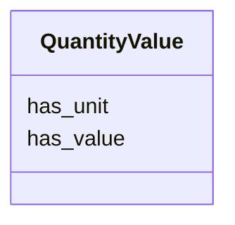

# Class: QuantityValue


URI: [monet_schema:QuantityValue](http://example.com/monet_schema/QuantityValue)





<!-- no inheritance hierarchy -->


## Slots

| Name | Cardinality and Range  | Description  |
| ---  | ---  | --- |
| [has_unit](has_unit.md) | 1..1 <br/> [xsd:string](xsd:string)  |   |
| [has_value](has_value.md) | 1..1 <br/> [xsd:float](xsd:float)  |   |


## Usages


| used by | used in | type | used |
| ---  | --- | --- | --- |
| [MaterialContainer](MaterialContainer.md) | [size](size.md) | range | QuantityValue |
| [MatSampProc](MatSampProc.md) | [amount](amount.md) | range | QuantityValue |


## Identifier and Mapping Information


### Schema Source


* from schema: http://example.com/monet_schema


## Mappings

| Mapping Type | Mapped Value |
| ---  | ---  |
| self | ['monet_schema:QuantityValue'] |
| native | ['monet_schema:QuantityValue'] |


## LinkML Specification

<!-- TODO: investigate https://stackoverflow.com/questions/37606292/how-to-create-tabbed-code-blocks-in-mkdocs-or-sphinx -->

### Direct

<details>
```yaml
name: QuantityValue
title: Quantity value
from_schema: http://example.com/monet_schema
rank: 1000
slots:
- has_unit
- has_value

```
</details>

### Induced

<details>
```yaml
name: QuantityValue
title: Quantity value
from_schema: http://example.com/monet_schema
rank: 1000
attributes:
  has_unit:
    name: has_unit
    title: has unit
    from_schema: http://example.com/monet_schema
    rank: 1000
    alias: has_unit
    owner: QuantityValue
    domain_of:
    - QuantityValue
    range: string
    required: true
  has_value:
    name: has_value
    title: has value
    from_schema: http://example.com/monet_schema
    rank: 1000
    alias: has_value
    owner: QuantityValue
    domain_of:
    - QuantityValue
    range: float
    required: true

```
</details>