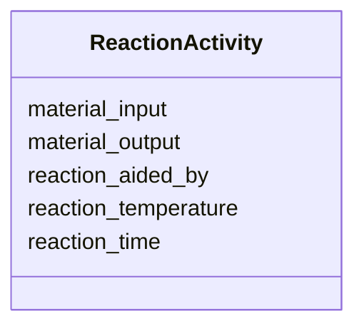

# Class: ReactionActivity


URI: [monet_schema:ReactionActivity](http://example.com/monet_schema/ReactionActivity)





<!-- no inheritance hierarchy -->


## Slots

| Name | Cardinality and Range  | Description  |
| ---  | ---  | --- |
| [material_input](material_input.md) | 0..1 <br/> [MaterialSample](MaterialSample.md)  |   |
| [material_output](material_output.md) | 0..1 <br/> [MaterialSample](MaterialSample.md)  |   |
| [reaction_time](reaction_time.md) | 0..1 <br/> [QuantityValue](QuantityValue.md)  |   |
| [reaction_aided_by](reaction_aided_by.md) | 0..1 <br/> [LabDevice](LabDevice.md)  |   |
| [reaction_temperature](reaction_temperature.md) | 0..1 <br/> [xsd:string](xsd:string)  |   |


## Usages


| used by | used in | type | used |
| ---  | --- | --- | --- |
| [Database](Database.md) | [reaction_activity_set](reaction_activity_set.md) | range | ReactionActivity |


## Identifier and Mapping Information


### Schema Source


* from schema: http://example.com/monet_schema


## Mappings

| Mapping Type | Mapped Value |
| ---  | ---  |
| self | ['monet_schema:ReactionActivity'] |
| native | ['monet_schema:ReactionActivity'] |


## LinkML Specification

<!-- TODO: investigate https://stackoverflow.com/questions/37606292/how-to-create-tabbed-code-blocks-in-mkdocs-or-sphinx -->

### Direct

<details>
```yaml
name: ReactionActivity
title: Reaction activity
from_schema: http://example.com/monet_schema
aliases:
- reaction-activity
rank: 1000
slots:
- material_input
- material_output
- reaction_time
- reaction_aided_by
- reaction_temperature

```
</details>

### Induced

<details>
```yaml
name: ReactionActivity
title: Reaction activity
from_schema: http://example.com/monet_schema
aliases:
- reaction-activity
rank: 1000
attributes:
  material_input:
    name: material_input
    title: material input
    examples:
    - value: somextract:6
    - value: soil:1
    from_schema: http://example.com/monet_schema
    aliases:
    - weighing-activity.source_material
    rank: 1000
    alias: material_input
    owner: ReactionActivity
    domain_of:
    - DissolvingProcess
    - MaterialSamplingProcess
    - ReactionActivity
    range: MaterialSample
  material_output:
    name: material_output
    title: material output
    examples:
    - value: somextract:7
    - value: somextract:6
    from_schema: http://example.com/monet_schema
    aliases:
    - weighing-activity.id
    rank: 1000
    alias: material_output
    owner: ReactionActivity
    domain_of:
    - DissolvingProcess
    - MaterialSamplingProcess
    - ReactionActivity
    range: MaterialSample
  reaction_time:
    name: reaction_time
    todos:
    - constrain units
    - align with process_time
    from_schema: http://example.com/monet_schema
    rank: 1000
    alias: reaction_time
    owner: ReactionActivity
    domain_of:
    - ReactionActivity
    range: QuantityValue
    inlined: true
  reaction_aided_by:
    name: reaction_aided_by
    title: reaction aided by
    from_schema: http://example.com/monet_schema
    aliases:
    - shaker
    rank: 1000
    alias: reaction_aided_by
    owner: ReactionActivity
    domain_of:
    - ReactionActivity
    range: LabDevice
    inlined: true
  reaction_temperature:
    name: reaction_temperature
    from_schema: http://example.com/monet_schema
    rank: 1000
    alias: reaction_temperature
    owner: ReactionActivity
    domain_of:
    - ReactionActivity
    range: string

```
</details>