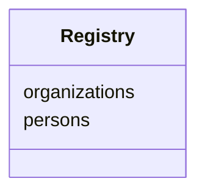

# Class: Registry
_Top level data container_


URI: [my_datamodel:Registry](https://w3id.org/my_org/my_datamodelRegistry)





<!-- no inheritance hierarchy -->


## Slots

| Name | Cardinality and Range  | Description  |
| ---  | ---  | --- |
| [persons](persons.md) | 0..* <br/> [Person](Person.md)  |   |
| [organizations](organizations.md) | 0..* <br/> [Organization](Organization.md)  |   |


## Usages


## Identifier and Mapping Information


### Schema Source


* from schema: https://w3id.org/my_org/my_datamodel


## Mappings

| Mapping Type | Mapped Value |
| ---  | ---  |
| self | ['my_datamodel:Registry'] |
| native | ['my_datamodel:Registry'] |


## LinkML Specification

<!-- TODO: investigate https://stackoverflow.com/questions/37606292/how-to-create-tabbed-code-blocks-in-mkdocs-or-sphinx -->

### Direct

<details>
```yaml
name: Registry
description: Top level data container
from_schema: https://w3id.org/my_org/my_datamodel
rank: 1000
attributes:
  persons:
    name: persons
    from_schema: https://w3id.org/my_org/my_datamodel
    rank: 1000
    multivalued: true
    range: Person
    inlined: true
    inlined_as_list: true
  organizations:
    name: organizations
    from_schema: https://w3id.org/my_org/my_datamodel
    rank: 1000
    multivalued: true
    range: Organization
    inlined: true
    inlined_as_list: true
tree_root: true

```
</details>

### Induced

<details>
```yaml
name: Registry
description: Top level data container
from_schema: https://w3id.org/my_org/my_datamodel
rank: 1000
attributes:
  persons:
    name: persons
    from_schema: https://w3id.org/my_org/my_datamodel
    rank: 1000
    multivalued: true
    alias: persons
    owner: Registry
    domain_of:
    - Registry
    range: Person
    inlined: true
    inlined_as_list: true
  organizations:
    name: organizations
    from_schema: https://w3id.org/my_org/my_datamodel
    rank: 1000
    multivalued: true
    alias: organizations
    owner: Registry
    domain_of:
    - Registry
    range: Organization
    inlined: true
    inlined_as_list: true
tree_root: true

```
</details>