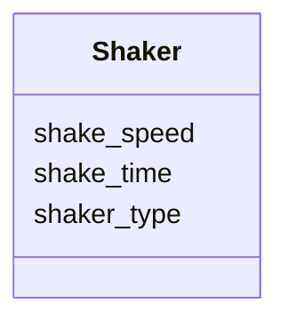

# Class: Shaker


URI: [monet_schema:Shaker](http://example.com/monet_schema/Shaker)





<!-- no inheritance hierarchy -->


## Slots

| Name | Cardinality and Range  | Description  |
| ---  | ---  | --- |
| [shake_speed](shake_speed.md) | 0..1 <br/> [QuantityValue](QuantityValue.md)  |   |
| [shake_time](shake_time.md) | 0..1 <br/> [QuantityValue](QuantityValue.md)  |   |
| [shaker_type](shaker_type.md) | 0..1 <br/> [ShakerTypeEnum](ShakerTypeEnum.md)  |   |


## Usages


| used by | used in | type | used |
| ---  | --- | --- | --- |
| [Dissolving](Dissolving.md) | [shaker_selection](shaker_selection.md) | range | Shaker |


## Identifier and Mapping Information


### Schema Source


* from schema: http://example.com/monet_schema


## Mappings

| Mapping Type | Mapped Value |
| ---  | ---  |
| self | ['monet_schema:Shaker'] |
| native | ['monet_schema:Shaker'] |


## LinkML Specification

<!-- TODO: investigate https://stackoverflow.com/questions/37606292/how-to-create-tabbed-code-blocks-in-mkdocs-or-sphinx -->

### Direct

<details>
```yaml
name: Shaker
title: Shaker
from_schema: http://example.com/monet_schema
rank: 1000
slots:
- shake_speed
- shake_time
- shaker_type

```
</details>

### Induced

<details>
```yaml
name: Shaker
title: Shaker
from_schema: http://example.com/monet_schema
rank: 1000
attributes:
  shake_speed:
    name: shake_speed
    title: shake speed
    from_schema: http://example.com/monet_schema
    rank: 1000
    alias: shake_speed
    owner: Shaker
    domain_of:
    - Shaker
    range: QuantityValue
  shake_time:
    name: shake_time
    title: shake time
    from_schema: http://example.com/monet_schema
    rank: 1000
    alias: shake_time
    owner: Shaker
    domain_of:
    - Shaker
    range: QuantityValue
  shaker_type:
    name: shaker_type
    title: shaker type
    from_schema: http://example.com/monet_schema
    rank: 1000
    alias: shaker_type
    owner: Shaker
    domain_of:
    - Shaker
    range: ShakerTypeEnum

```
</details>